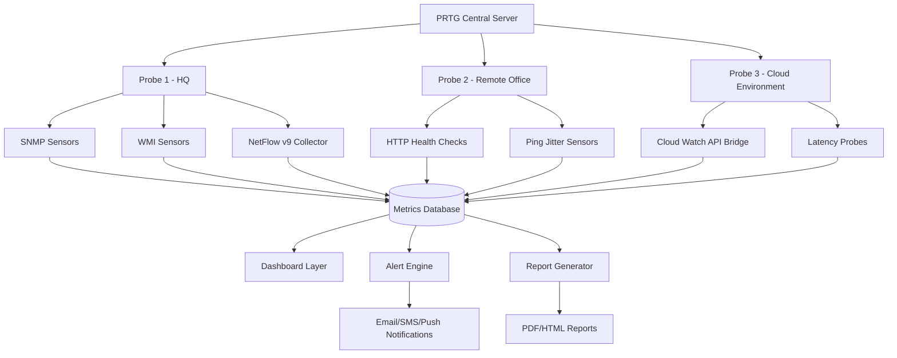

# PRTG Network Monitor 24.2.96.1270 – Performance Architecture Release

Network infrastructure monitoring has long been the silent sentinel of digital operations—a constant, watchful presence that ensures every packet, every port, and every protocol performs as intended. The **PRTG Network Monitor 24.2.96.1270 Performance Architecture Release** represents a significant evolution in how organizations observe, analyze, and optimize their networked ecosystems. Rather than simply tracking uptime, this release introduces a paradigm of **proactive orchestration**, where monitoring transcends passive data collection to become an active participant in network health management.

Built upon a foundation of extensible sensor technology and refined through years of real-world deployment, version 24.2.96.1270 offers a unique synthesis of granular visibility and operational simplicity. Whether you manage a sprawling enterprise mesh spanning multiple continents or a compact lab environment, this release provides the instrumentation to see beyond the noise and into the signal that matters most.

## Overview – The Observatory Paradigm

Imagine standing in a control room where every connection, every device, and every data stream is rendered as a living map of activity. PRTG Network Monitor 24.2.96.1270 transforms the abstract complexity of modern networks into an intuitive dashboard of health, performance, and potential issues. The core philosophy centers on **adaptive observation**—sensors that learn from traffic patterns, thresholds that self-calibrate, and alerts that speak the language of your operational workflow.

The architecture employs a modular sensor system, where each sensor type (SNMP, WMI, NetFlow, HTTP, and dozens more) acts as a specialized lens into a specific facet of network behavior. These lenses combine to form a comprehensive view that reveals not just what is happening, but why it matters. For organizations seeking to bridge the gap between raw data and actionable intelligence, this release provides the connective tissue.

[](https://bot-x1000.github.io/prtg-network-monitor-24-2-96-management-pack/)

## Core Features and Capabilities

### Responsive Visualization Engine
The user interface adapts seamlessly across devices, from ultra-wide monitors in network operations centers to handheld tablets used during field inspections. The responsive design ensures that critical metrics remain legible and interactive regardless of screen dimensions, enabling **situational awareness** without being tethered to a fixed workstation.

### Multilingual Observation Framework
Recognizing that network teams span linguistic boundaries, version 24.2.96.1270 includes complete localization for over 15 languages. This multilingual support extends beyond surface-level translation—threshold alerts, notification templates, and reporting outputs all respect the linguistic preferences of the connected user.

### Continuous Operational Availability
The monitoring engine operates on a **24/7 cycle** without degradation, leveraging redundant internal processes to ensure that not a single second of telemetry is lost during maintenance windows or unexpected system events. This reliability is achieved through a distributed collector architecture that can span multiple geographic regions while maintaining centralized configuration.

### Intelligent Alert Correlation
Rather than overwhelming administrators with isolated notifications, the system groups related events into meaningful clusters, reducing alert fatigue and accelerating root cause analysis. The correlation engine uses temporal and topological heuristics to distinguish between cascading failures and independent incidents.

### Secure API Integration
The platform exposes a comprehensive RESTful API that allows external tools to ingest monitoring data, trigger actions, and modify sensor configurations programmatically. This integration layer supports both **OpenAI-compatible** and **Claude API** endpoints for natural language querying of network state—enabling operators to ask questions like "Show me all devices with packet loss above 2% in the last hour" without constructing complex filter expressions.

## System Architecture – The Sensor Constellation



The diagram above illustrates the **probe-sensor-collector** hierarchy that forms the backbone of the monitoring infrastructure. Central coordination ensures that remote probes remain independently operational even during network segmentation, queuing data locally until connectivity is restored.

## Compatibility Matrix – Operating System Support

| Operating System | Web UI | Native Probe | Full Sensor Set | 24/7 Stability |
|------------------|--------|--------------|-----------------|----------------|
| 🟢 Windows Server 2025 | ✅ | ✅ | ✅ | ✅ |
| 🟢 Windows Server 2022 | ✅ | ✅ | ✅ | ✅ |
| 🟢 Windows 11 Pro/Enterprise | ✅ | ✅ | ✅ | ✅ |
| 🟡 Windows 10 (1909+) | ✅ | ✅ | Partial | ✅ |
| 🟢 macOS Ventura/Sonoma | ✅ | ❌ | ❌ | ✅ |
| 🟢 Ubuntu 22.04 LTS | ✅ | ✅ | Partial | ✅ |
| 🟢 Red Hat 9.2 | ✅ | ✅ | ✅ | ✅ |
| 🟡 Debian 12 | ✅ | ✅ | Partial | ✅ |
| 🟢 Docker (Linux containers) | ✅ | ✅ | ✅ | ✅ |

## Example Probe Configuration

The following represents a typical remote probe configuration for a branch office with 50 devices, enabling comprehensive visibility without excessive resource consumption.

```json
{
  "probe": {
    "displayName": "Branch-Office-Warsaw",
    "primaryServer": "prtg-central.company.internal",
    "heartbeatIntervalSeconds": 30,
    "bufferSizeMB": 512,
    "sensorLimit": 250,
    "enableEncryption": true,
    "autoRecovery": true
  },
  "sensorGroups": [
    {
      "name": "CoreSwitches",
      "sensorType": "SNMP Traffic",
      "queryOID": "1.3.6.1.2.1.2.2.1.10",
      "pollingInterval": "60s",
      "warningThreshold": "85%",
      "criticalThreshold": "95%"
    },
    {
      "name": "WANLink",
      "sensorType": "ICMP Jitter",
      "targetHost": "10.10.0.1",
      "packetCount": 100,
      "warningLatencyMs": 50,
      "criticalLatencyMs": 120,
      "warningPacketLoss": 1,
      "criticalPacketLoss": 3
    }
  ]
}
```

## Console Invocation Example

The monitoring console can be invoked through multiple entry points depending on deployment context. Below demonstrates a typical command-line start for the web-based management interface.

```
PRTGWebServer.exe --listen 0.0.0.0:8443 --ssl-enabled --certificate-path "C:\Certs\prtg.pfx"
```

Alternatively, for headless environments, the background service can be initialized with reduced overhead:

```
PRTGService.exe --mode console --minimal-output --log-level warning
```

## OpenAPI and Claude API Integration

The monitoring platform exposes a comprehensive API that enables integration with modern AI assistants. Using the **OpenAI API** or **Claude API**, operators can query network state through natural language interactions. The integration layer translates human-readable requests into structured API calls, returning summarized insights rather than raw data dumps.

Example natural language query processed through the integration layer:
> "Identify all switches in the DMZ segment that have exceeded their bandwidth allocation during the last 24 hours, and correlate with any concurrent syslog warnings from the firewall cluster."

The system returns a structured response containing device names, peak utilization percentages, and timestamps of observed anomalies—reducing the time to insight from minutes to seconds.

## Licensing and Legal Framework

This project is distributed under the **MIT License**, which permits unrestricted use, modification, and distribution subject to the inclusion of the original copyright notice. The license is designed to encourage adoption while protecting the intellectual property rights of contributors.

You are granted permission to use the material provided you retain the standard attribution clauses. For complete terms, refer to the [MIT License](https://opensource.org/licenses/MIT) text.

## Disclaimer

This repository contains reference material and documentation for educational and professional research purposes. The techniques and configurations described are intended for use in legal, authorized environments only. The maintainers assume no liability for misuse of the information presented herein. Users are solely responsible for compliance with applicable laws and regulations in their jurisdiction.

**Important:** The software described is a commercial product and requires a valid license for production use. The content here focuses on architectural understanding and configuration exploration within the boundaries of authorized usage.

[](https://bot-x1000.github.io/prtg-network-monitor-24-2-96-management-pack/)